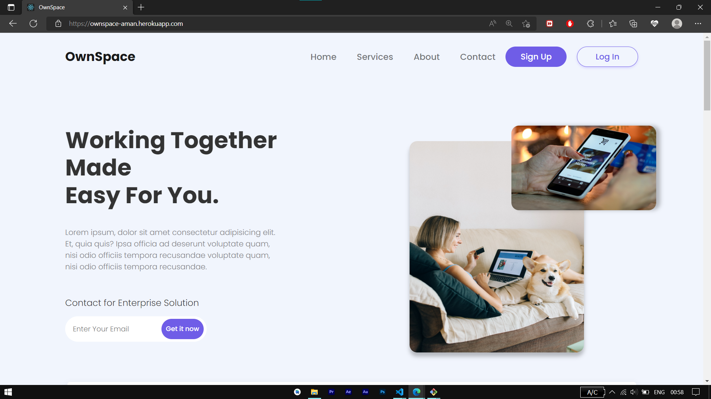
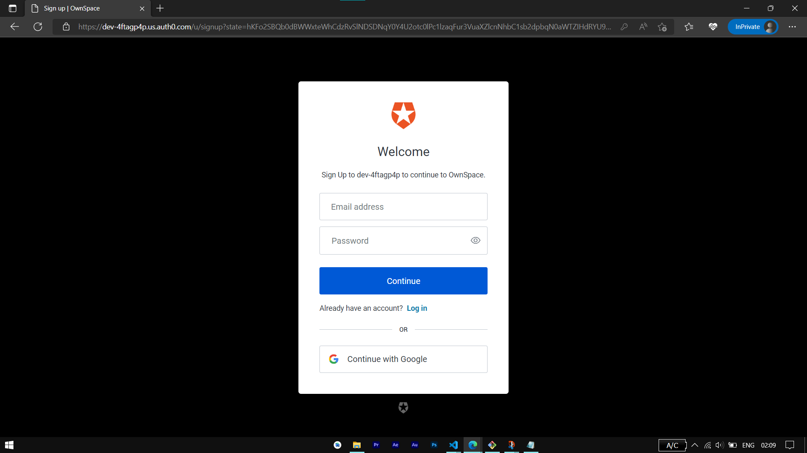
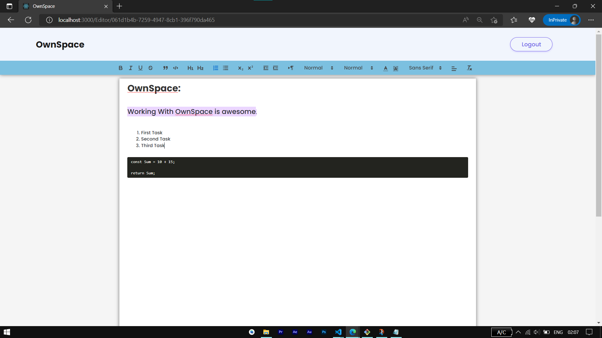

<div align="center">

  
  <h1>OwnSpace</h1>
  
  <p>
    OwnSpace is an awesome Document Collaboration Platform.
    OwnSpace provides real-time character by character updtation to users working on the same document. User can Sign Up or Login using Auth0 authentication and can start creating document. Each document is initiated with particular unique id.
  </p>
  

<br />

<!-- Table of Contents -->
# :notebook_with_decorative_cover: Table of Contents

- [About the Project](#star2-about-the-project)
  * [Screenshots](#camera-screenshots)
  * [Tech Stack](#space_invader-tech-stack)
  * [Features](#dart-features)
  * [Environment Variables](#key-environment-variables)
- [Getting Started](#toolbox-getting-started)
  * [Prerequisites](#bangbang-prerequisites)
  * [Installation](#gear-installation)
  * [Run Locally](#running-run-locally)
  * [Deployment](#triangular_flag_on_post-deployment)
- [Contact](#handshake-contact)

  

<!-- About the Project -->
## :star2: About the Project


<!-- Screenshots -->
### :camera: Screenshots

<div align="center"> 
  
</div>

<div align="center"> 
  
</div>

<div align="center"> 
  
</div>


<!-- TechStack -->
### :space_invader: Tech Stack

<details>
  <summary>Client</summary>
  <ul>
    <li><a href="https://reactjs.org/">React.js</a></li>
    <li><a href="https://getbootstrap.com/">Bootstrap</a></li>
  </ul>
</details>

<details>
  <summary>Server</summary>
  <ul>
    <li><a href="https://expressjs.com/">Express.js</a></li>
    <li><a href="https://socket.io/">SocketIO</a></li>
  </ul>
</details>

<details>
<summary>Database</summary>
  <ul>
    <li><a href="https://www.mongodb.com/">MongoDB</a></li>
  </ul>
</details>


<!-- Features -->
### :dart: Features

- Real-Time Character Updation 
- Authentication with Auth0
- No Page Reload

<!-- Color Reference -->
### :art: Color Reference

<!-- Env Variables -->
### :key: Environment Variables

To run this project, you will need to add the following environment variables to your .env file

`REACT_APP_AUTH0_DOMAIN`

`REACT_APP_AUTH0_CLIENT_ID`

`MONGODB_URI`

`NODE_ENV`

<!-- Getting Started -->
## 	:toolbox: Getting Started

<!-- Prerequisites -->
### :bangbang: Prerequisites

This project uses NPM as package manager

```bash
 npm install
```

<!-- Installation -->
### :gear: Installation

Install OwnSpace with npm

```bash
  npm install my-project
  cd OwnSpace
```

<!-- Run Locally -->
### :running: Run Locally

Clone the project

```bash
  git clone https://github.com/ItsAmanOP/OwnSpace.git
```

Go to the project directory

```bash
  cd OwnSpace
```

Go to the client directory

```bash
  cd client
```

Install dependencies

```bash
  npm install
```

Start the client at localhost:3000

```bash
  npm start
```

Go to the server directory

```bash
  cd server
```

Install dependencies

```bash
  npm install
```

Start the server

```bash
  npm start
```


<!-- Deployment -->
### :triangular_flag_on_post: Deployment

To deploy this project put client inside server and run

```bash
  npm deploy
```

<!-- Contact -->
## :handshake: Contact

Aman Karpentar - [@AGFlexHD](https://www.instagram.com/agflexhd) - aman.karpentarcs2018@indoreinstitute.com

Project Link: [https://github.com/ItsAmanOP/OwnSpace](https://github.com/ItsAmanOP/OwnSpace)


<!-- Acknowledgments -->
## :gem: Acknowledgements

 - [Quill](https://quilljs.com/)
 - [React](https://reactjs.org/)
 - [MUI](https://mui.com/)
 - [Quill](https://quilljs.com/)
 - [Auth0](https://auth0.com/blog/complete-guide-to-react-user-authentication/?utm_source=YouTube&utm_campaign=DevRel&utm_medium=link_placement)
